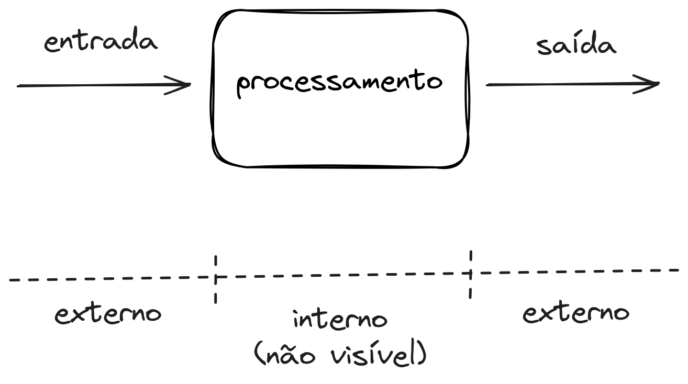
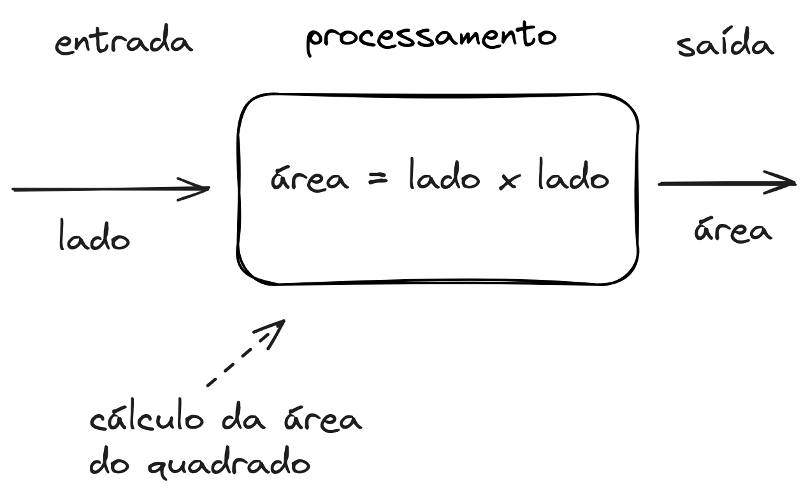

# Modelo de caixa fechada

Para que exista a interação do algoritmo desenvolvido com agentes externos a ele como o usuário, monitor, teclado, internet, mouse, arquivos, etc., é necessário que algumas funções específicas sejam utilizadas.

<!-- marp --- -->

Algoritmos tratam da transformação da informação. Podemos entender um algoritmo como uma **caixa fechada** [@wiki:CaixaPreta], ou seja, um sistema que recebe dados de **entrada** e apresenta dados de **saída** sem que possamos conhecer o que está ocorrendo internamente na caixa.

<!-- marp --- -->

A entrada de dados consiste nas informações a serem trabalhadas, e a saída consiste no resultado das operações realizadas sobre a entrada.

**Exemplo**

- Cálculo da área de um quadrado.

<!-- marp --- -->

