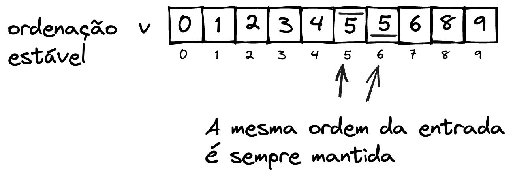
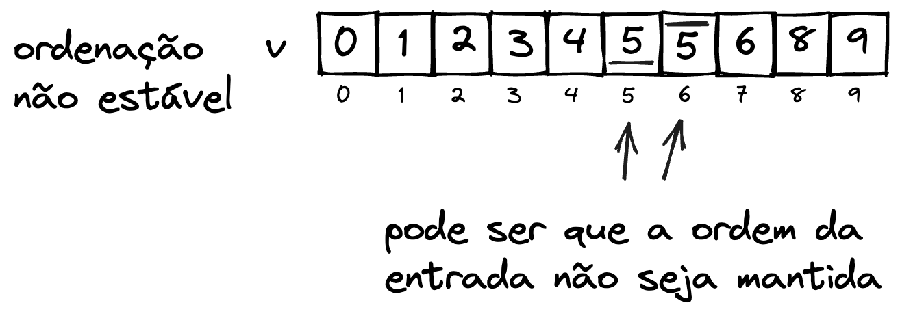

# Ordenação

Alguns princípios

- Se o vetor possui um único elemento, ele já se encontra ordenado.

- Elementos de qualquer tipo podem ser ordenados. Para tal, é necessário que seja possível comparar esses elementos. É comum nas linguagens de programação que uma função de comparação seja passada.

$n$ é o número total de elementos no vetor.

## Troca de elementos
::::::{prf:algorithm} Troca de elementos
:name: alg:troca

- **Entrada:** Vetor com valores, posição $i$, posição $j$
- **Saída:** Sem retorno. Realiza a troca no próprio vetor.

<!-- TABSET -->
:::::{tab-set}
::::{tab-item} Pseudocódigo
:sync: pseudocodigo

```c
função troca(vetor de inteiro v, inteiro i, inteiro j)
inicio
    inteiro tmp;
    tmp = v[i];
    v[i] = v[j]
    v[j] = tmp
fim;
```

::::
::::{tab-item} Java
:sync: java

```java
public static void troca(int[] v, int i, int j){
    int tmp = v[i];
    v[i] = v[j];
    v[j] = tmp;
}
```

::::
::::{tab-item} Python
:sync: python


```python
def troca(v, i, j){
    v[i], v[j] = v[j], v[i]
}
```

::::
::::{tab-item} C
:sync: c

```c
printf("Hello world!\n");
```

::::
:::::
::::::

## Funções de comparação

## Estabilidade

Dizemos que um algoritmo de ordenação é **estável** se ele preserva a ordem de elementos iguais da entrada.

**Exemplo**

Considere a utilização de dois exemplos de algoritmos distintos que ordenam a entrada apontada em [](#fig:ordenacao-estavel_entrada). Observe que na entrada o valor $5$ aparece duas vezes, e para diferenciar, estes estão sinalizados como $\overline{5}$ e $\underline{5}$

<!--  -->

::::{figure} ./img/ordenacao_estavel_01-entrada.png
:name: fig:ordenacao-estavel_entrada

Exemplo de conjunto com dados repetidos

::::

### Algoritmo estável

A saída do algoritmo de ordenação estável preserva a ordem sempre, independente da posição em que os elementos de mesmo valor estão. A [](#fig:ordenacao-estavel) a seguir ilustra a saída de um algoritmo de ordenação estável.

<!--  -->

::::{figure} ./img/ordenacao_estavel_02-estavel.png
:name: fig:ordenacao-estavel

Ordenação estável
::::

### Algoritmo não estável

Podem ocorrer situações em que um algoritmo de ordenação estável não preserve a ordem de elementos iguais, como indicado na [](#fig:ordenacao-nao_estavel). Os dados estão ordenados, porém a estabilidade trata de como **elementos de mesmo valor** estão organizados.

<!--  -->

::::{figure} ./img/ordenacao_estavel_03-nao_estavel.png
:name: fig:ordenacao-nao_estavel

Ordenação não estável
::::

## Ordenações no lugar fora do lugar

Os algoritmos de ordenação também podem ser diferenciados pela necessidade de utilização de espaço adicional para ordenação. Algoritmos que permitem ordenar os dados diretamente na mesma estrutura de entrada são definidos como algoritmos **no lugar** (*in place*), e os que requerem uma estrutura adicional como **fora do lugar** (*out of place*).