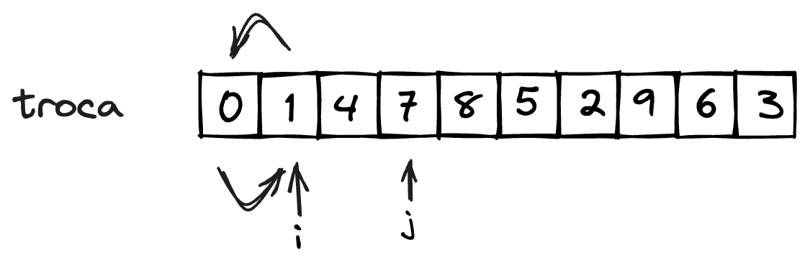

# Insertion Sort

O algoritmo ***Insertion Sort***, ou algoritmo da **inserção ordenada** consiste em percorrer a entrada da direita para a esquerda. Caso o valor observado seja menor que o valor anterior, estes são trocados, trazendo o valor observado para a esquerda até que o valor da esquerda já não seja menor [@brunet2019:insertion-sort]. 


**Exemplo**  

Considere a entrada apresentada na [](#fig:ordenacao-insertion_entrada):

<!--  -->

::::{figure} ./img/insertion_sort_01-entrada.png
:name: fig:ordenacao-insertion_entrada

Entrada a ser ordenada
::::

O valor $j$ pode ser percorrido a partir da posição $1$, onde é comparado com o elemento da posição anterior, neste caso posição $0$ ([](#fig:ordenacao-insertion_comparacao)).

<!--  -->

::::{figure} ./img/insertion_sort_02-comparacao.png
:name: fig:ordenacao-insertion_comparacao

Comparacao com elemento da posição anterior
::::

caso o valor seja menor que o anterior (que é o caso do exemplo), significa que o elemento que está na posição $j$ está no lugar errado em relação ao anterior, e estes devem ser trocados ([](#fig:ordenacao-insertion_troca)).

<!--  -->

::::{figure} ./img/insertion_sort_03-troca.png
:name: fig:ordenacao-insertion_troca

Troca de elementos
::::

observe que o sub-conjunto composto pelos elementos das posições $0$ a $j$ está ordenado. Com isto, $j$ avança em um posição, e a comparação se repete ([](#fig:ordenacao-insertion_avanco)).

<!--  -->

::::{figure} ./img/insertion_sort_04-comparacao.png
:name: fig:ordenacao-insertion_avanco

Dados de $0$ a $j$ ordenados
::::

observe que o elemento na posição $j$ é maior que o da posição $j-1$. Neste caso, nenhuma operação é necessária, visto que o elemento na posição $j$ está na posição correta, em relação ao elemento imediatamente anterior. Com isto, o valor de $j$ é incrementado e avança para o próximo elemento ([](#fig:ordenacao-insertion_comparacao_incremento)).

<!--  -->

::::{figure} ./img/insertion_sort_05-comparacao.png
:name: fig:ordenacao-insertion_comparacao_incremento

Avanço para a próxima posição ainda não ordenada
::::


Enquanto o valor na posição $i$ for menor que o da $i-1$, realiza a troca de valores entre $i$ e $i-1$ e decrementa o valor de $i$ ([](#fig:ordenacao-insertion_volta), [](#fig:ordenacao-insertion_volta_comparando), [](#fig:ordenacao-insertion_volta_trocando) e [](#fig:ordenacao-insertion_volta_continua_trocando)). 

<!--  -->

::::{figure} ./img/insertion_sort_06-troca.png
:name: fig:ordenacao-insertion_volta

Troca de elementos
::::

<!--  -->

::::{figure} ./img/insertion_sort_07-comparacao.png
:name: fig:ordenacao-insertion_volta_comparando

Volta comparando os elementos
::::

<!--  -->

::::{figure} ./img/insertion_sort_08-troca.png
:name: fig:ordenacao-insertion_volta_trocando

Volta comparando elementos, trocando caso não esteja na ordem
::::

<!--  -->

::::{figure} ./img/insertion_sort_09-comparacao.png
:name: fig:ordenacao-insertion_volta_continua_trocando

Volta comparando elementos, trocando caso não esteja na ordem
::::

O índice $i$ pára de voltar quando o elemento na posição $i$ seja maior que o da posição $i-1$, ou seja, esteja no lugar correto ([](#fig:ordenacao-insertion_volta_parada)).

<!--  -->

::::{figure} ./img/insertion_sort_10-troca.png
:name: fig:ordenacao-insertion_volta_parada

Volta comparando elementos, e caso esteja na ordem pára de voltar
::::

## Implementação

::::::{prf:algorithm} Insertion Sort

**Entrada:** Vetor a ser ordenado.  
**Saída:** Sem retorno. Atualiza no próprio vetor de entrada.

<!-- TABSET -->
:::::{tab-set}
::::{tab-item} Pseudocódigo
:sync: pseudocodigo

```c
escreva("Hello world!");
```

::::
::::{tab-item} Java
:sync: java

```java
public static void insertionSort(int[] v){
    int i,j;
    for(j=1;j<v.length;j++){
        i=j;
        while(i>0 && v[i] < v[i-1]){
            troca(v, i, i-1);
            i--;
        }
    }
}
```

::::
::::{tab-item} Python
:sync: python

```python
def insertionSort(v):
    for j in range(1, len(v)):
        i=j
        while i>0 and v[i] < v[i-1]:
            troca(v, i, i-1)
            i-=1
```

::::
::::{tab-item} C
:sync: c

```c
printf("Hello world!\n");
```

::::
:::::
::::::


## Tipo de dados genéricos

## Recursividade

O algoritmo do Insertion Sort pode ser implementado também de maneira recursiva, porém não é recomendado devido ao alto número de chamadas, facilmente levando a um estouro de pilha.

::::::{prf:algorithm} Insertion Sort Recursivo

**Entrada:** Vetor a ser ordenado.  
**Saída:** Sem retorno. Atualiza no próprio vetor de entrada.

<!-- TABSET -->
:::::{tab-set}
::::{tab-item} Pseudocódigo
:sync: pseudocodigo

```c
escreva("Hello world!");
```

::::
::::{tab-item} Java
:sync: java

```java
public static void insertionSortRec(int[] v){
    insertionSortRec_(v, 1);
}

public static void insertionSortRec_(int[] v, end){
    int i = end;
    if(end < v.length){
        while(i>0 && v[i]<v[i-1]){
            troca(v,i,i-1);
            i--;
        }
        insertionSortRec_(v, end+1);
    }
}
```

::::
::::{tab-item} Python
:sync: python

```python
def insertionSortRec(v):
    insertionSortRec_(v, 1)


def insertionSortRec_(v, fim):
    i = fim
    if fim < len(v):
        while i>0 and v[i]<v[i-1]:
            troca(v, i, i-1)
            i-=1
        insertionSortRec(v, fim+1)
```

::::
::::{tab-item} C
:sync: c

```c
printf("Hello world!\n");
```

::::
:::::
::::::


## Análise

