# Quick Sort

O algoritmo do Quick Sort pode ser abordado utilizando divisão e conquista, em que a fase de divisão chamamos de particionamento. Após realizado o particionamento é obtida uma posição chave, em que elementos à esquerda dessa posição são menores que os que estão à direita dessa posição. O elemento que estiver nessa posição chave chamaremos de **pivô**.

Tomemos como exemplo a seguinte entrada:

<!--  -->
::::{figure} img/quick_sort_p1.png
:name: fig:quicksort-p1

Dados de entrada
::::

A partir desta entrada, escolheremos um dos elementos para que seja o pivô. Aqui, escolheremos o elemento mais à esquerda da entrada. Feito isso, realizaremos o processo de [particionamento](#par-quicksort-particionamento), que consiste em colocar o pivô em sua posição correta.

<!-- 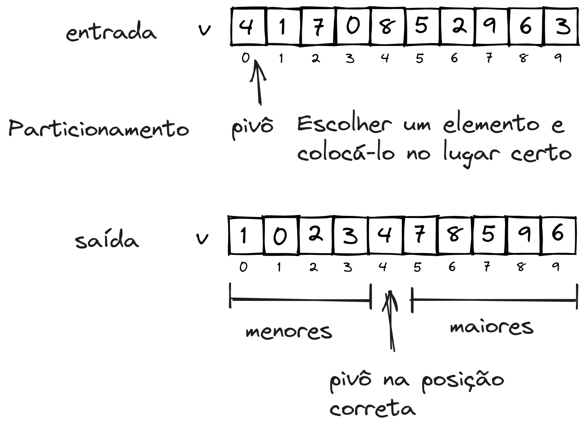 -->
::::{figure} img/quick_sort_p2.png
:name: fig:quicksort-p2

Escolha do pivô
::::

Observe que na imagem acima, todos os elemento à esquerda do pivô são menores que ele e os à direita são maiores.

Com isto, o particionamento deixa o pivô escolhido já está em sua posição correta, e pode-se então chamar o quick sort de maneira recursiva nas demais posições do vetor. 

De maneira geral, temos o seguinte algoritmo recursivo:

::::::{prf:algorithm} Quick Sort: chamadas às funções de particionamento
:name: alg:quicksort

**Entrada:** Vetor a ser ordenado.  
**Saída:** Sem retorno. Vetor de entrada modificado, com os dados ordenados.

<!-- TABSET -->
:::::{tab-set}
::::{tab-item} Pseudocódigo
:sync: pseudocodigo

```c
escreva("Hello world!");
```

::::
::::{tab-item} Java
:sync: java

```java
public static void quickSort(int[] v){
    quickSort_(v, 0, v.length-1);
}

public static void quickSort_(int[] v, int ini, int fim){
    int pos_pivot = quickSort_particionamento(v, ini, fim);
    quickSort_(v, ini, pos_pivot-1); //recursão nos elementos antes do pivô
    quickSort_(v, pos_pivot+1, fim); //recursão nos elementos depois do pivô
}
```

::::
::::{tab-item} Python
:sync: python

```python
def quickSort(v):
    quickSort_(v, 0, len(v)-1):

def quickSort_i(v, ini, fim):
    pos_pivot = quickSort_particionamento(v, ini, fim)
    quickSort_(v, ini, pos_pivot-1) #recursão nos elementos antes do pivô
    quickSort_(v, pos_pivot+1, fim) #recursão nos elementos depois do pivô
```

::::
::::{tab-item} C
:sync: c

```c
printf("Hello world!\n");
```

::::
:::::
::::::


Uma execução recursiva completa do exemplo pode ser vista de maneira geral a seguir.

<!-- 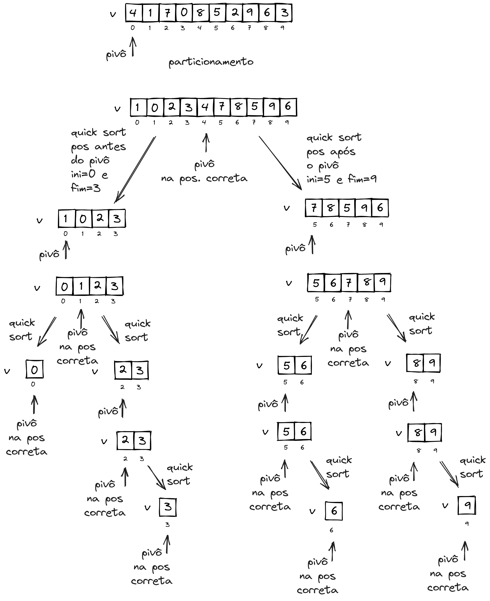 -->
::::{figure} img/quick_sort_recursao_p1.png
:name: fig:quicksort-recursao_p1

Particionamento executado recursivamente
::::

(par-quicksort-particionamento)=
## Particionamento

### Näive

De forma a demonstrar um possível tipo de particionamento simplificado, seria utilizar dois vetores auxiliares: um contendo os valores maiores e outro contendo os valores menores que o pivô. 

**Exemplo**

Consideremos como entrada os valores presentes no vetor $v$:

<!--  -->
::::{figure} img/quick_sort_naive_p01.png
:name: fig:quicksort-naive_p01

Entrada de exemplo
::::

Neste caso, escolheremos como pivô o primeiro elemento. Precisaremos também de um vetor auxiliar $aux$, além dos índices $k$, $i$ e $j$. O índice $k$ indica o elemento a ser comparado com o pivô. Os índices $i$ e $j$ apontam para as extremidades do vetor $aux$, sendo $i$ na primeira e $j$ na última posições.

<!-- 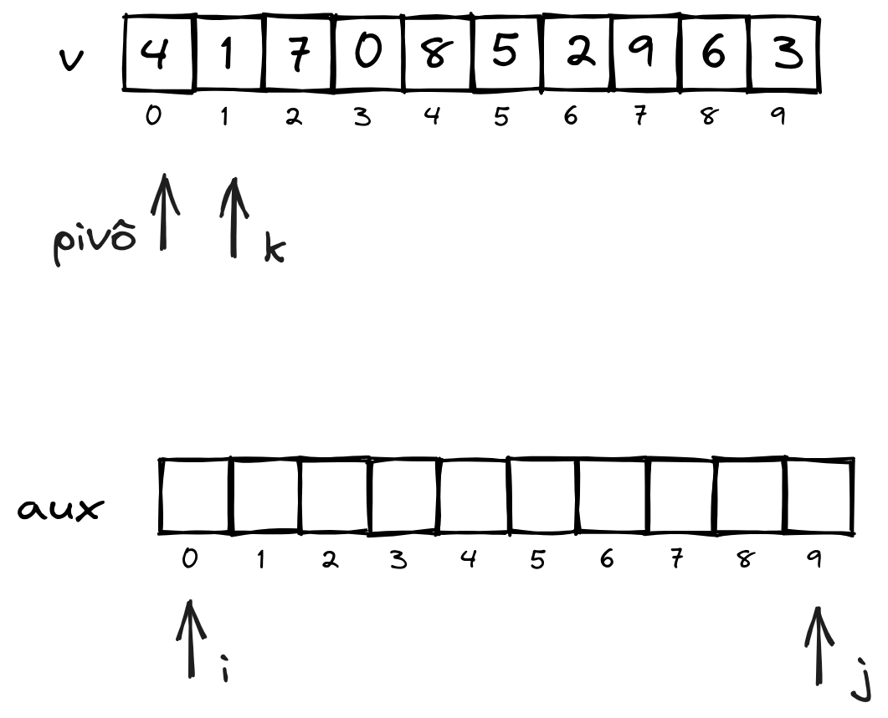 -->
::::{figure} img/quick_sort_naive_p02.png
:name: fig:quicksort-naive_p02

Pivô na primeira posição
::::

O processo consiste em observar o valor do vetor $aux$ na posição $k$ e compará-lo com o pivô. Caso seja menor ou igual, o valor é copiado para $aux$ na posição $i$, e caso seja maior, para $aux$ na posição $j$.

<!-- 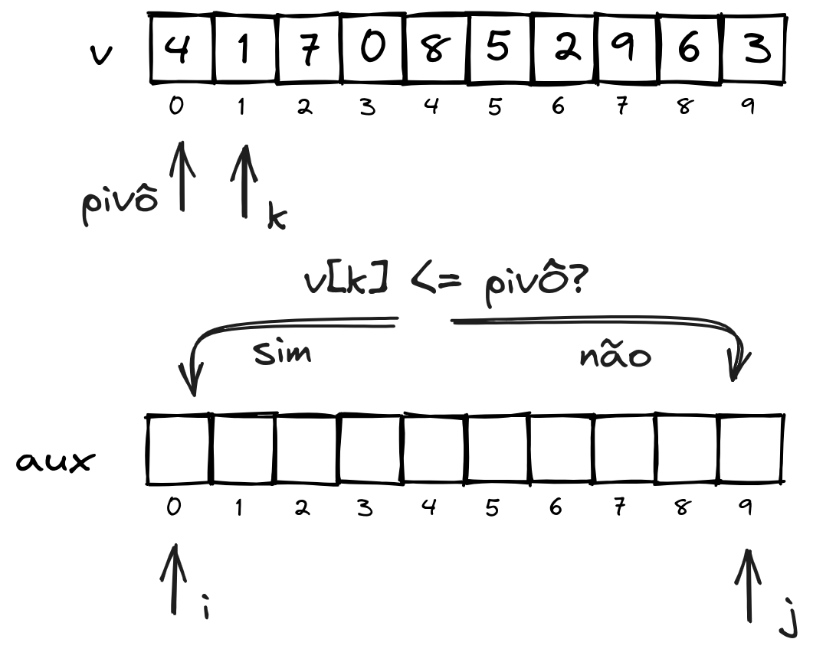 -->
::::{figure} img/quick_sort_naive_p03.png
:name: fig:quicksort-naive_p03

Decisão de onde copiar o valor apontado pelo pivô
::::

Após realizar a cópia, o índices $k$ deve ser incrementado. Também deve ser incrementado o índice $i$, indicando que o próximo valor menor que o pivô seja gravado na próxima posição.

<!-- 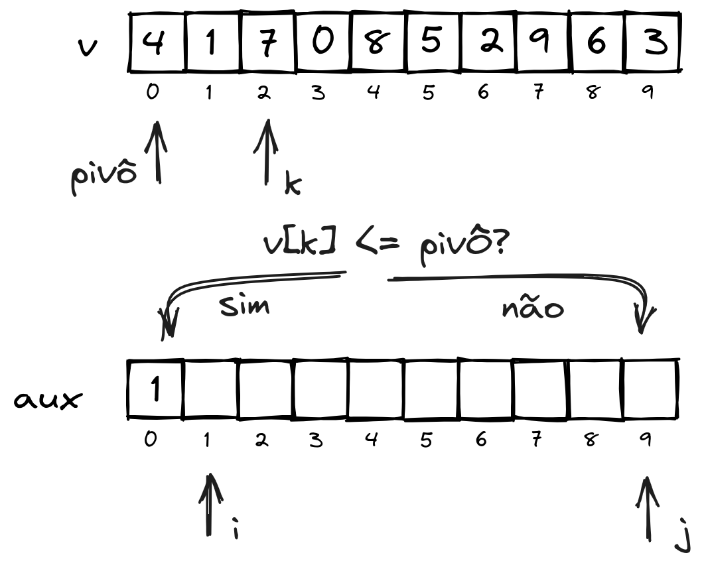 -->
::::{figure} img/quick_sort_naive_p04.png
:name: fig:quicksort-naive_p04

Atualização de índices e decisão de onde copiar o valor apontado pelo pivô
::::

Este processo é repetido até que $k$ tenha percorrido todos os elementos da entrada. As figuras a seguir indicam este processo.

<!-- 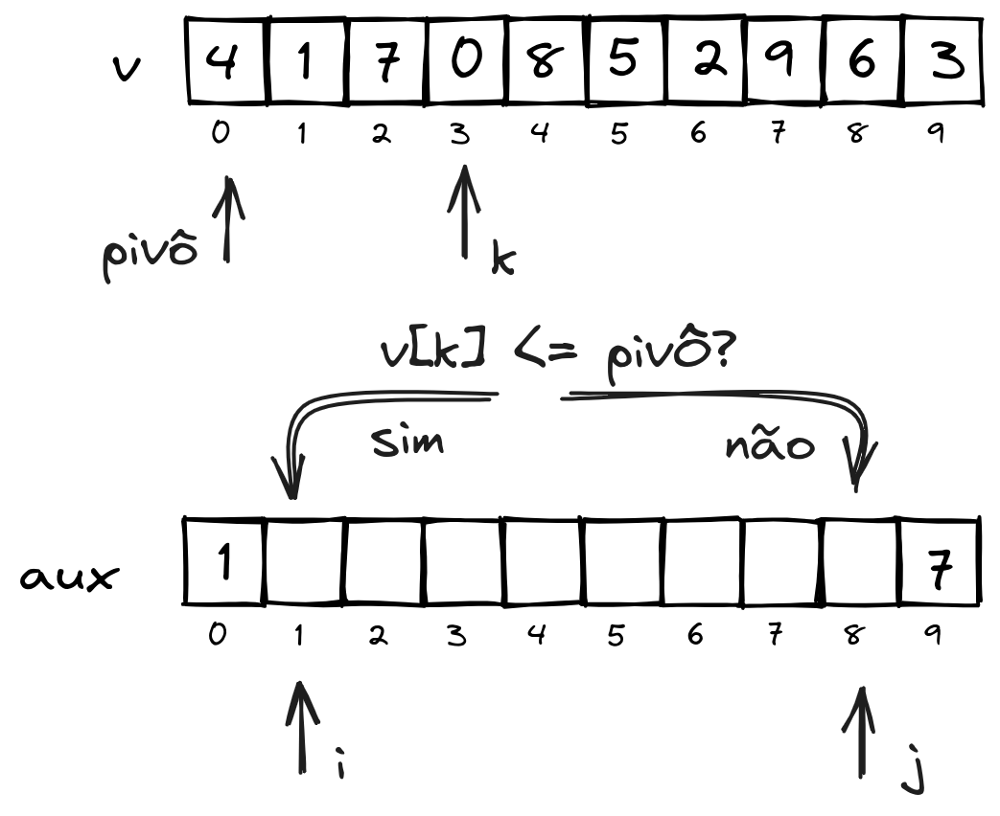 -->
::::{figure} img/quick_sort_naive_p05.png
:name: fig:quicksort-naive_p05

Atualização de índices e decisão de onde copiar o valor apontado pelo pivô
::::

<!-- 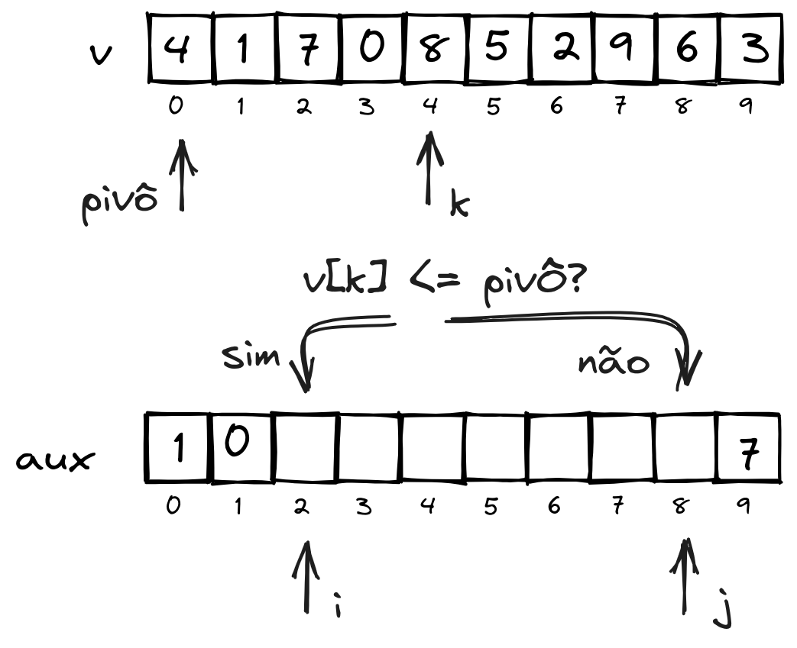 -->
::::{figure} img/quick_sort_naive_p06.png
:name: fig:quicksort-naive_p06

Atualização de índices e decisão de onde copiar o valor apontado pelo pivô
::::

<!-- 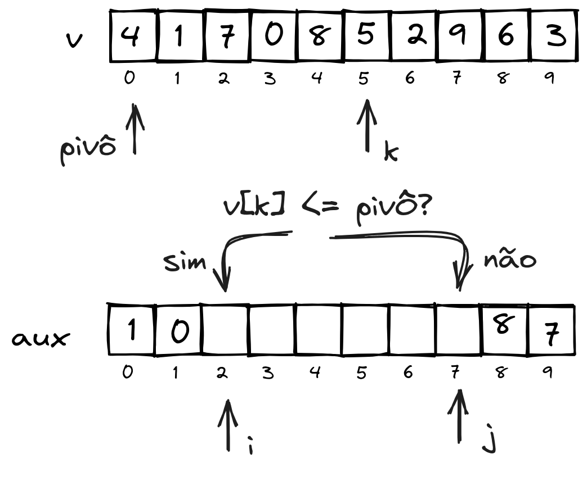 -->
::::{figure} img/quick_sort_naive_p07.png
:name: fig:quicksort-naive_p07

Atualização de índices e decisão de onde copiar o valor apontado pelo pivô
::::

<!-- 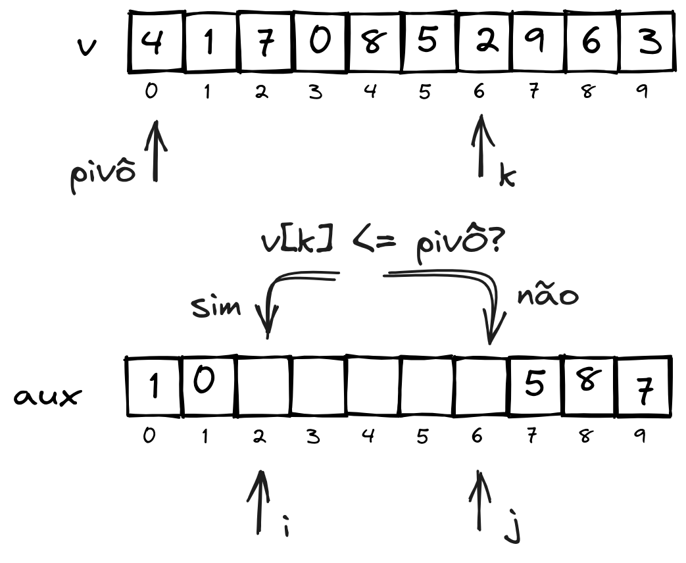 -->
::::{figure} img/quick_sort_naive_p08.png
:name: fig:quicksort-naive_p08

Atualização de índices e decisão de onde copiar o valor apontado pelo pivô
::::

<!-- 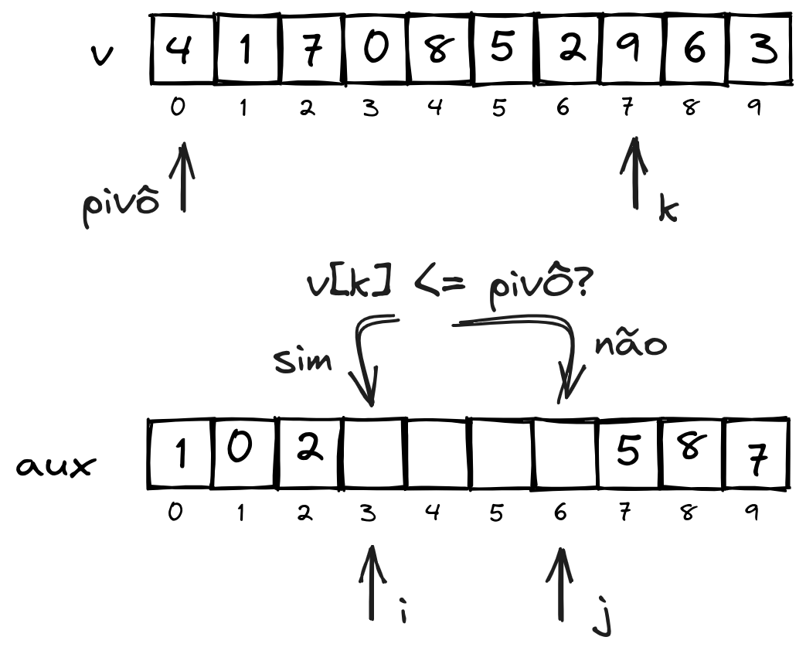 -->
::::{figure} img/quick_sort_naive_p09.png
:name: fig:quicksort-naive_p09

Atualização de índices e decisão de onde copiar o valor apontado pelo pivô
::::

<!-- 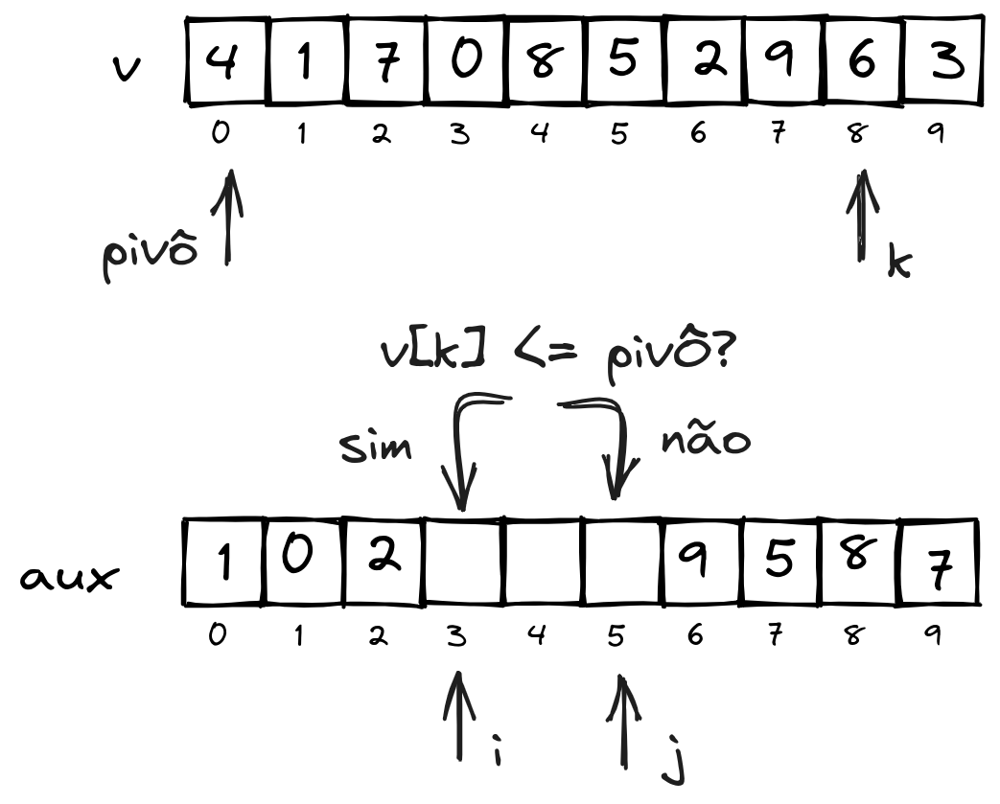 -->
::::{figure} img/quick_sort_naive_p10.png
:name: fig:quicksort-naive_p10

Atualização de índices e decisão de onde copiar o valor apontado pelo pivô
::::


<!-- 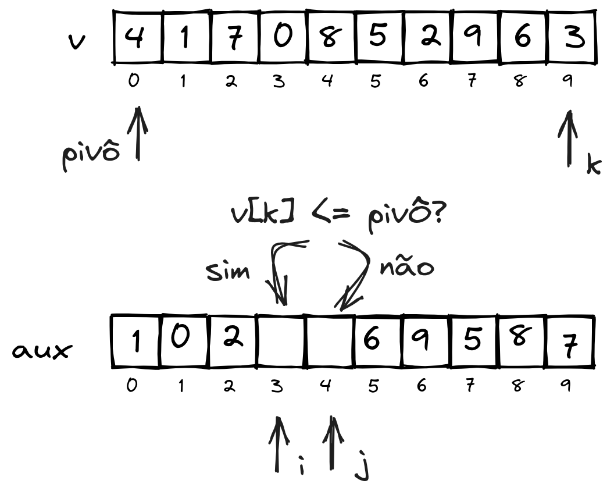 -->
::::{figure} img/quick_sort_naive_p11.png
:name: fig:quicksort-naive_p11

Atualização de índices e decisão de onde copiar o valor apontado pelo pivô
::::

Após $k$ percorrer todos os dados da entrada, o valor do pivô é copiado para a posição que falta preencher. Neste momento, tanto $i$ como $j$ apontam para a mesma posição. No exemplo, utilizaremos o índice $i$.

<!-- 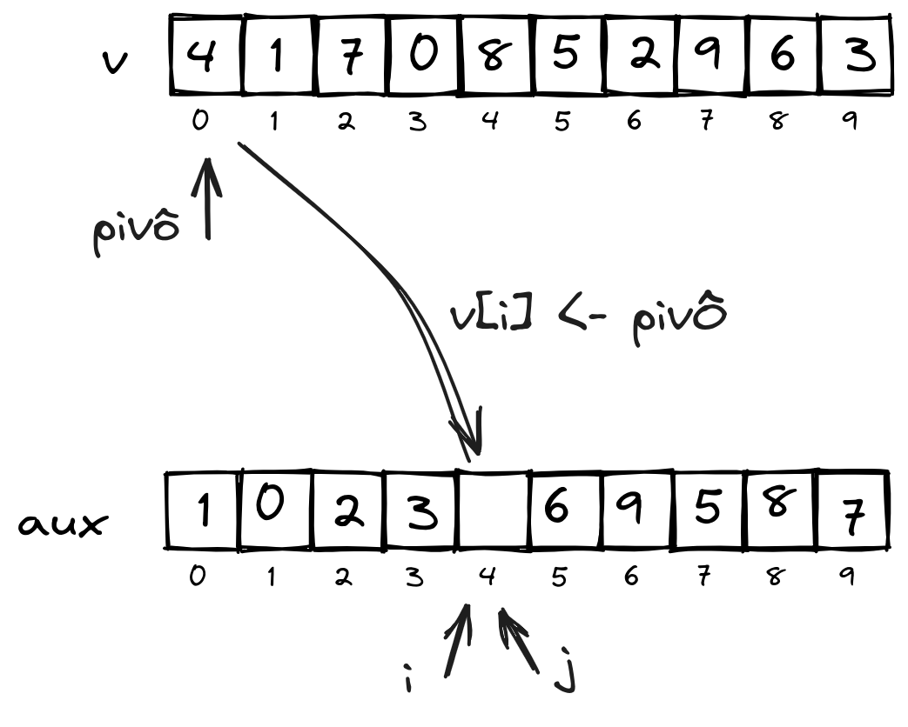 -->
::::{figure} img/quick_sort_naive_p12.png
:name: fig:quicksort-naive_p12

Quando $i=j$, o elemento apontado pelo pivô é copiado para essa posição
::::

Neste momento o pivô já está no vetor $aux$ em sua posição correta.

<!-- 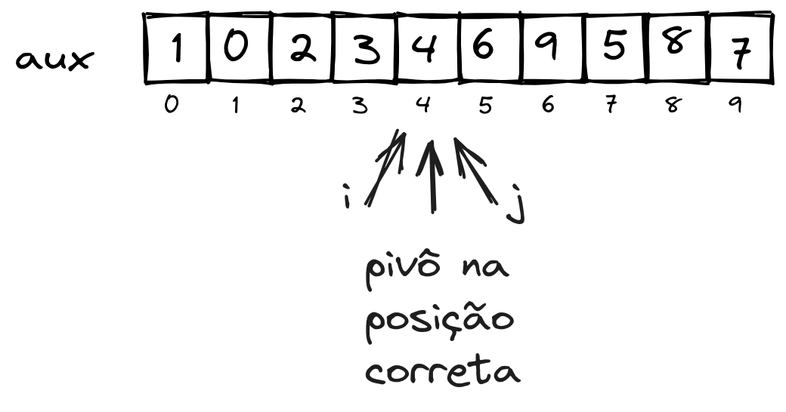 -->
::::{figure} img/quick_sort_naive_p13.png
:name: fig:quicksort-naive_p13

Pivô na posição correta
::::

Resta então copiar os elementos do vetor $aux$ para $v$, e o processo de particionamento é finalizado.

<!-- 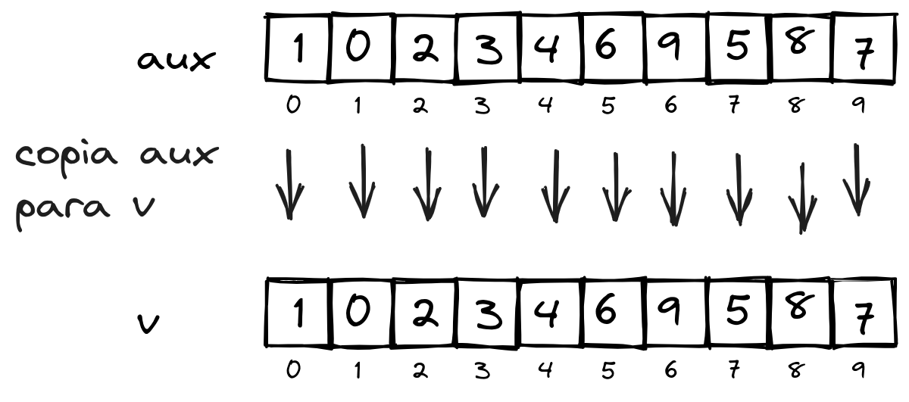 -->
::::{figure} img/quick_sort_naive_p14.png
:name: fig:quicksort-naive_p14

Cópia dos valores do vetor auxiliar para o vetor de entrada
::::

Esta abordagem poderia ser implementada da seguinte maneira:

::::::{prf:algorithm} Quick Sort: Particionamento Näive
:name: alg:quicksort-particionamento_naive

**Entrada:** Vetores a ser ordenado, posição inicial, posição final.  
**Saída:** Posição do pivô.

<!-- TABSET -->
:::::{tab-set}
::::{tab-item} Pseudocódigo
:sync: pseudocodigo

```c
escreva("Hello world!");
```

::::
::::{tab-item} Java
:sync: java

```java
public static void int quickSortPartNaive(int[] v, int ini, int fim){
    int pivot = v[ini]; //primeiro elemento é o pivot
    int[] aux = new int[fim-ini+1]
    int i=ini, j=fim, pos_pivot, k;
    

    for(k=ini+1;k<=fim;k++){
        if(v[k] <= pivot){
            aux[i] = v[k]; //valores menores ou iguais são copiados para o início
            i++;
        }else{
            aux[j] = v[k]; //valores maiores são copiados para o final
            j--;
        }
    }

    pos_pivot=i; //guarda a posição do pivot
    aux[i] = pivot //copia o pivot para aux
    //copia os valores de volta ao vetor v
    for(k=ini;k<=fim;k++){
        v[k] = aux[k-ini];
    }
    

    return pos_pivot;
}
```

::::
::::{tab-item} Python
:sync: python

```python
import numpy as np
def quickSortPartNaive(v, ini, fim):
    pivot = v[ini] #primeiro elemento é o pivot
    aux = np.zeros(fim-ini+1)
    i=ini
    j=fim
    
    for k in range(ini+1, fim+1):
        if v[k] <=pivot:
            aux[i] = v[k] #valores menores ou iguais são copiados para o início
            i+=1
        else:
            aux[j] = v[k] #valores maiores são copiados para o final
            j-=1

    pos_pivot=i #guarda a posição do pivot
    aux[pos_pivot] = pivot #copia o pivot para aux
    #copia os valores de volta ao vetor v
    for k in range(ini, fim+1):
        v[k] = aux[k-ini]

    return pos_pivot
```

::::
::::{tab-item} C
:sync: c

```c
printf("Hello world!\n");
```

::::
:::::
::::::

### Lomuto

O particionamento apresentado em Cormen é chamado de particionamento de Lomuto [@cormen2022].

<!--  -->
::::{figure} img/quick_sort_cormen_p01.png
:name: fig:quicksort-cormen_p01

Dados de entrada
::::

<!-- 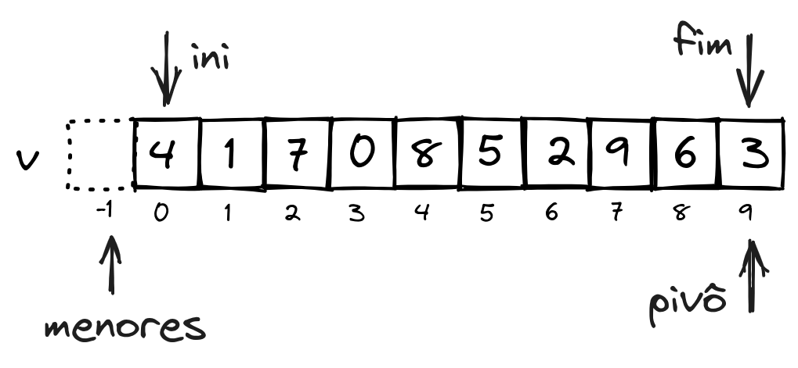 -->
::::{figure} img/quick_sort_cormen_p02.png
:name: fig:quicksort-cormen_p02

Pivô na última posição, índice de menores em posição fora do vetor (à esquerda)
::::

<!-- 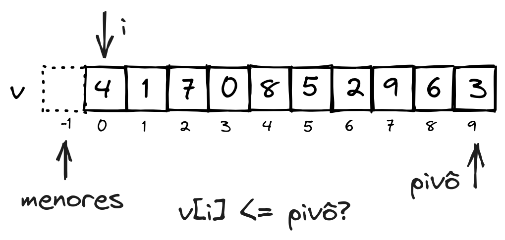 -->
::::{figure} img/quick_sort_cormen_p03.png
:name: fig:quicksort-cormen_p03

Comparação se o valor apontado pelo índice $i$ é menor que o pivô
::::

<!-- 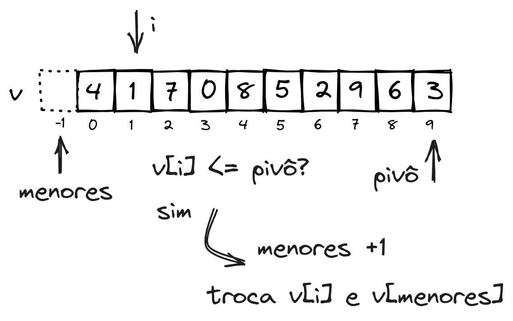 -->
::::{figure} img/quick_sort_cormen_p04.png
:name: fig:quicksort-cormen_p04

Comparação se o valor apontado pelo índice $i$ é menor que o pivô. Caso sim, incrementa o índice de menores e troca o valor nessa posição pelo valor na posição $i$
::::

<!-- 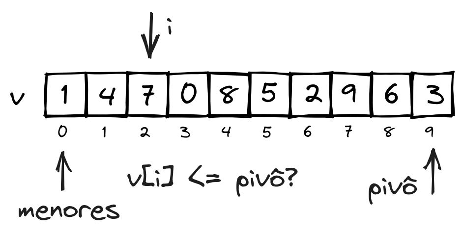 -->
::::{figure} img/quick_sort_cormen_p05.png
:name: fig:quicksort-cormen_p05

Comparação se o valor apontado pelo índice $i$ é menor que o pivô. Caso sim, incrementa o índice de menores e troca o valor nessa posição pelo valor na posição $i$
::::

<!-- 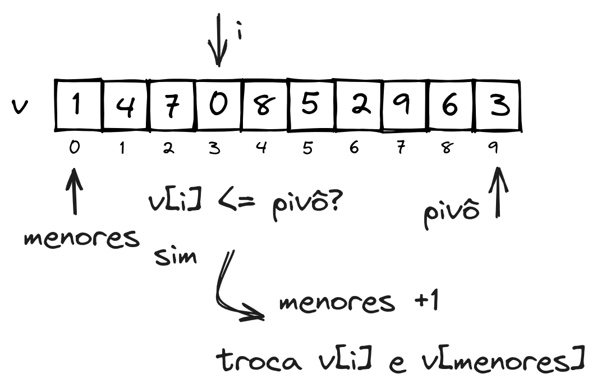 -->
::::{figure} img/quick_sort_cormen_p06.png
:name: fig:quicksort-cormen_p06

Comparação se o valor apontado pelo índice $i$ é menor que o pivô. Caso sim, incrementa o índice de menores e troca o valor nessa posição pelo valor na posição $i$
::::

<!-- 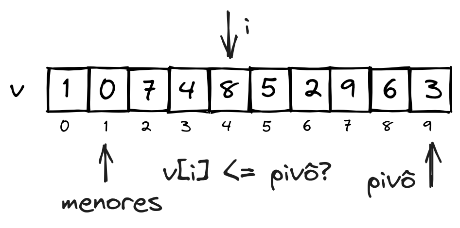 -->
::::{figure} img/quick_sort_cormen_p07.png
:name: fig:quicksort-cormen_p07

Comparação se o valor apontado pelo índice $i$ é menor que o pivô. Caso sim, incrementa o índice de menores e troca o valor nessa posição pelo valor na posição $i$
::::

<!-- 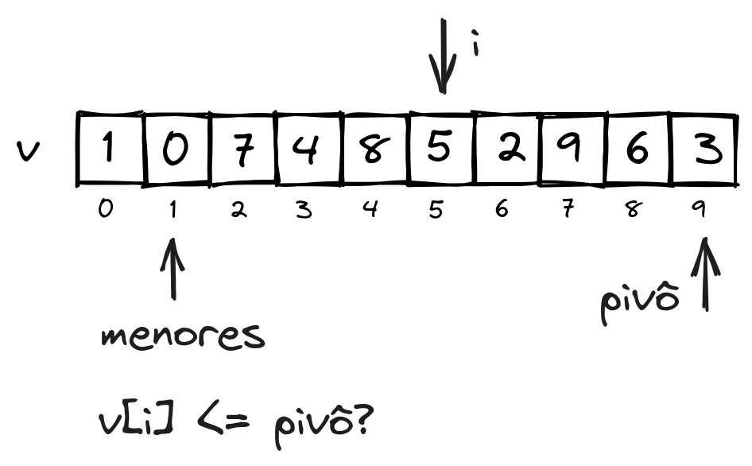 -->
::::{figure} img/quick_sort_cormen_p08.png

Comparação se o valor apontado pelo índice $i$ é menor que o pivô. Caso sim, incrementa o índice de menores e troca o valor nessa posição pelo valor na posição $i$
::::

<!-- 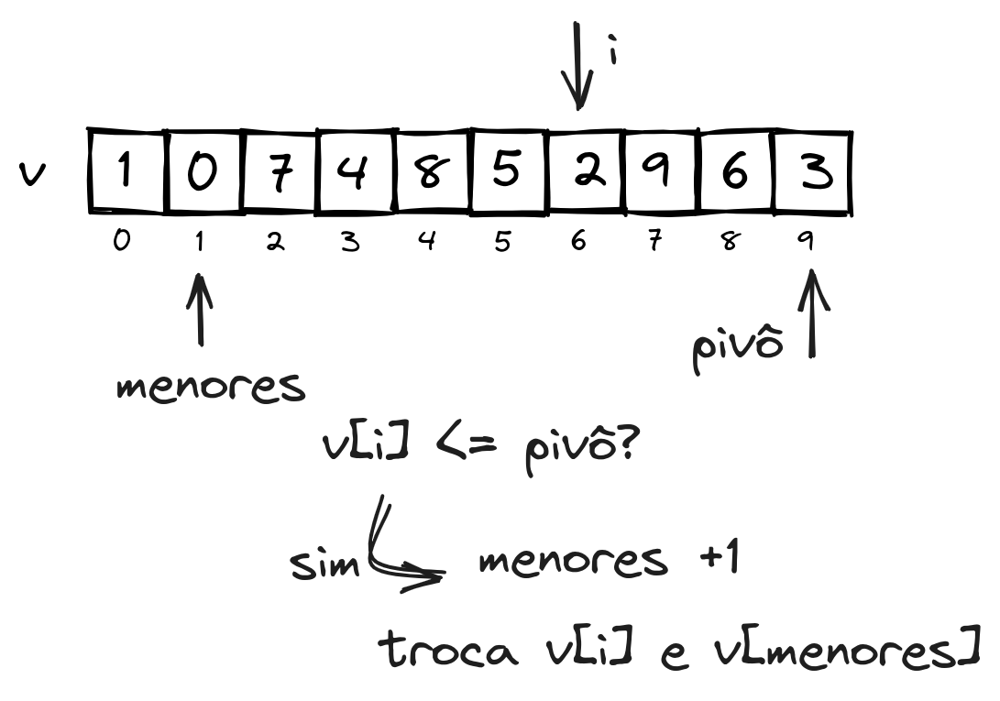 -->
::::{figure} img/quick_sort_cormen_p09.png
:name: fig:quicksort-cormen_p09

Comparação se o valor apontado pelo índice $i$ é menor que o pivô. Caso sim, incrementa o índice de menores e troca o valor nessa posição pelo valor na posição $i$
::::

<!-- 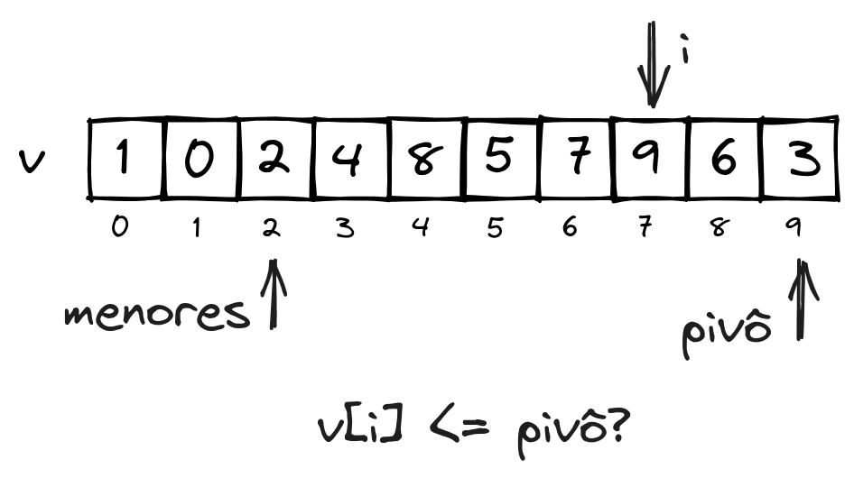 -->
::::{figure} img/quick_sort_cormen_p10.png
:name: fig:quicksort-cormen_p10

Comparação se o valor apontado pelo índice $i$ é menor que o pivô. Caso sim, incrementa o índice de menores e troca o valor nessa posição pelo valor na posição $i$
::::

<!-- 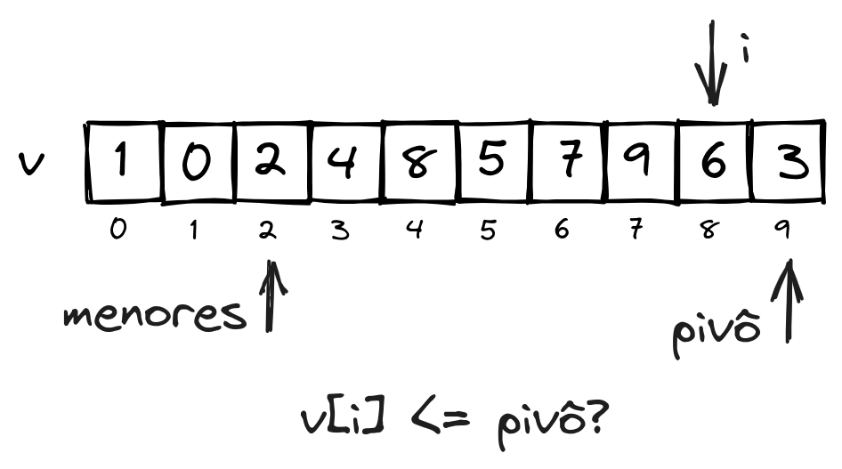 -->
::::{figure} img/quick_sort_cormen_p11.png
:name: fig:quicksort-cormen_p11

Comparação se o valor apontado pelo índice $i$ é menor que o pivô. Caso sim, incrementa o índice de menores e troca o valor nessa posição pelo valor na posição $i$
::::

<!-- 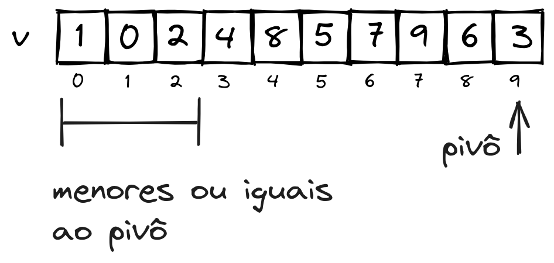 -->
::::{figure} img/quick_sort_cormen_p12.png
:name: fig:quicksort-cormen_p12

$i$ chegou ao final
::::

<!-- 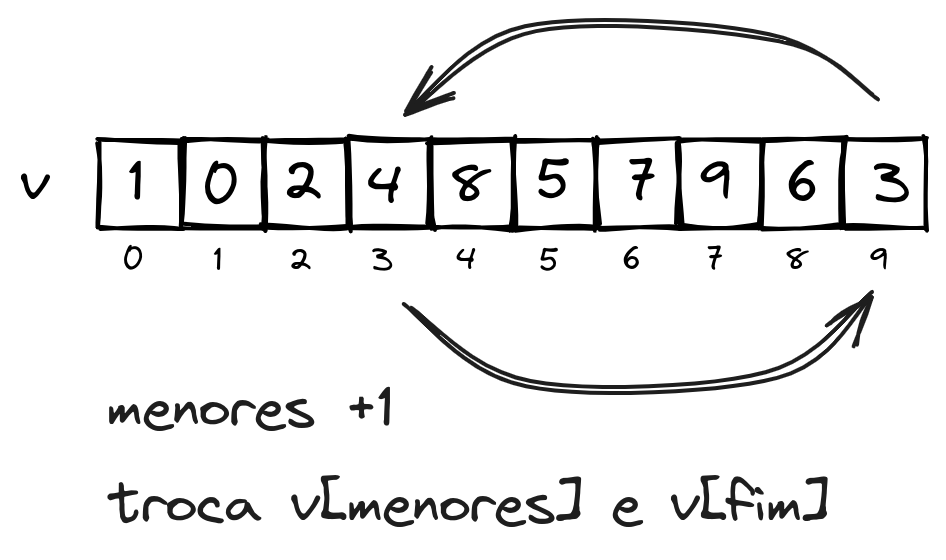 -->
::::{figure} img/quick_sort_cormen_p13.png
:name: fig:quicksort-cormen_p13

Incremento da posição de menores, e troca do valor nessa posição pelo pivô
::::

<!-- 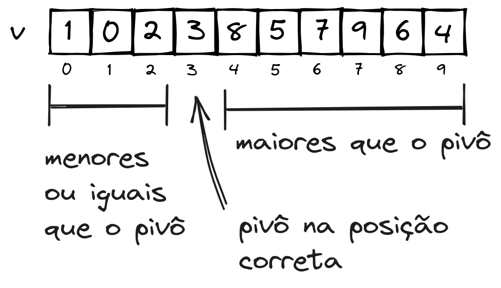 -->
::::{figure} img/quick_sort_cormen_p14.png
:name: fig:quicksort-cormen_p14

Pivô na posição correta, dividindo o conjunto em duas partes. Menores ou iguais à esquerda e maiores à direita do pivô
::::

::::::{prf:algorithm} Quick Sort: Particionamento de Lomuto
:name: alg:quicksort-particionamento_lomuto

**Entrada:** Vetores a ser ordenado, posição inicial, posição final.  
**Saída:** Posição do pivô.

<!-- TABSET -->
:::::{tab-set}
::::{tab-item} Pseudocódigo
:sync: pseudocodigo

```c
escreva("Hello world!");
```

::::
::::{tab-item} Java
:sync: java

```java
static int quickSortPartCormen(int[] v, int ini, int fim) {
        int pivot = v[fim]; //<- pivô é o último elemento
        int pos_menores = ini - 1; //<- menores ou iguais que o pivô

        for (int i = ini; i < fim; i++) {
            if (v[i] <= pivot) {
                pos_menores++;
                troca(v, pos_menores, i);
            }
        }
        pos_menores++;
        troca(v, pos_menores, fim);
        return pos_menores;
    }
```

::::
::::{tab-item} Python
:sync: python

```python
def quickSortPartCormen(v, ini, fim):
    pivot = v[fim] #<- pivô é o último elemento
    pos_menores = ini -1 #<- menores ou iguais que o pivô

    for i in range(ini, fim):
        if v[i] <= pivot:
            pos_menores +=1
            troca(v, pos_menores, i)
    pos_menores+=1
    troca(v, pos_menores, fim)
    return pos_menores
```

::::
::::{tab-item} C
:sync: c

```c
printf("Hello world!\n");
```

::::
:::::
::::::

Uma ilustração do particionamento de Lomuto pode ser vista em vídeo, com explicação do Prof. Eduardo Falcão:

:::{iframe} https://www.youtube.com/embed/AuiIZ_zFKP8?si=v_x8LeOIwlbE8P1r&amp;start=956
:width: 100%

Particionamento de Lomuto [@falcao2022:quicksort]
:::

### Hoare

O particionamento de *Hoare* é o particionamento original do Quick Sort. Seu nome deve-se a seu criador, o cientista da computação britânico [Charles Antony Richard Hoare](https://pt.wikipedia.org/wiki/Charles_Antony_Richard_Hoare) [@hoare_wikipedia]. O algoritmo consiste em utilizar dois índices, um a partir da esquerda do vetor e outro a partir da direita. O da esquerda é incrementado até que um valor maior que o pivô seja encontrado, e o índice da direita faz o contrário: é decrementado até encontrar um valor menor que o pivô. Quando os dois índices encontram esses valores, os valores são trocados e o processo se repete. Isto é feito até que os dois índices se encontrem. Quando se encontrarem, esta é a posição do pivô.


::::::{prf:algorithm} Quick Sort: Particionamento de Hoare
:name: alg:quicksort-particionamento_hoare

**Entrada:** Vetores a ser ordenado, posição inicial, posição final.  
**Saída:** Posição do pivô.

<!-- TABSET -->
:::::{tab-set}
::::{tab-item} Pseudocódigo
:sync: pseudocodigo

```c
escreva("Hello world!");
```

::::
::::{tab-item} Java
:sync: java

```java
public static int quickSortPartHoare(int[] v, int ini, int fim){
    pivot = A[ini]
    idx_esq = ini-1;
    idx_dir = fim+1;
    while(true){
        do{
            idx_dir--;
        }while(v[idx_dir]<=pivot);
        do{
            idx_esq++;
        }while(v[idx_esq]>=pivot);
        if(idx_esq<j){
            troca(v,idx_esq,idx_dir)
        }else{
            return idx_dir;
        }
    }
}
```

::::
::::{tab-item} Python
:sync: python

```python
def quickSortPartHoare(v, ini, fim):
    pivot = v[ini]
    idx_esq = ini-1
    idx_dir = fim+1
    while True:
        idx_dir-=1
        while v[idx_dir] <=pivot:
            idx_dir-=1
        i+=1
        while v[idx_esq] >= pivot:
            idx_esq+=1
        if i<idx_dir:
            troca(v,idx_esq,idx_dir)
        else:
            return idx_dir
```

::::
::::{tab-item} C
:sync: c

```c
printf("Hello world!\n");
```

::::
:::::
::::::


### Pivôs bons e ruins

Os melhores pivôs a serem utilizados são aqueles que a sua posição final divide a entrada da forma mais equilibrada possível, ou seja, em que o pivô fica na posição central.

Pivôs ruins são aqueles em que a posição correta do pivô divide a entrada da maneira desequilibrada, ou seja, o pivô fica em uma das extremidades.

Algumas maneiras de encontrar pivôs melhores podem ser:
- escolher um elemento em posição aleatória
- observar três elementos do conjunto, e escolher o elemento da mediana destes (valor do meio).

**Exercícios**  
1. Considere como entrada para Quick Sort o vetor com os valores `1,2,3,4,5,6,7,8,9`, e em seguida
    - ordene escolhendo sempre o elemento mais à esquerda como pivô;
    - ordene utilizando o elemento da mediana entre os elementos nas posições ini, fim e o elemento do meio (`(fim-ini)/2+ini`)
    - elabore as árvores de recursão, comparando as ordenações anteriores.

## Tipo de dados genéricos

<!-- ## Iterativo -->

## Análise
