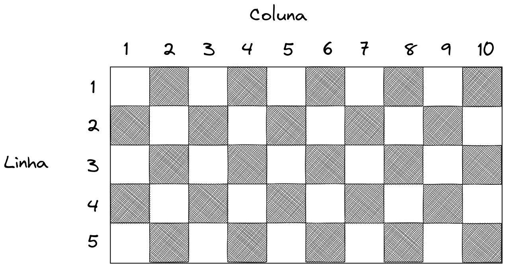

# Algoritmos e Estruturas de Dados
## Trabalho 1º Bimestre

1. Faça um programa para um caixa eletrônico. O programa deverá perguntar ao usuário a valor que deseja sacar e em seguida informar quantas notas de cada valor serão fornecidas, apresentando o menor número possível de notas. As notas disponíveis são de 1, 2, 5, 10, 20, 50 e 100 Reais. O menor valor possível para saque é de R\$ 1,00, e o valor máximo é de  de R\$ 5000,00. O programa não deve se preocupar com a quantidade de notas existentes na máquina. 

**Exemplos**

  - Para sacar R\$ 256,00:
    - 2 notas de R\$ 100,00
    - 1 nota de R\$ 50,00
    - 1 nota de R\$ 5,00
    - 1 nota de R\$ 1,00
  - Para sacar R\$ 399,00 reais:
    - 3 notas de R\$ 100,00 
    - 1 nota de R\$ 50,00
    - 2 notas de R\$ 20,00
    - 1 nota de R\$ 10,00
    - 1 nota de R\$ 5,00
    - 2 notas de R\$ 2,00
    - 1 nota de R\$ 1,00

2. Um posto está vendendo combustíveis com a seguinte tabela de descontos:

<!-- :::{table} Tabela de descontos -->

|Quantidade|Etanol|Gasolina|
|------------------|--------|--|
|até 20 litros     |desconto de 3%|desconto de 4% |
|acima de 20 litros|desconto de 5%|desconto de 6% |  

<!-- ::: -->

Escreva um algoritmo que leia o número de litros vendidos, o tipo de combustível (codificado da seguinte forma: E-etanol, G-gasolina). Calcule e imprima o preço final a ser pago pelo cliente, sabendo que o preço do litro da gasolina é R\$ 5,60 o preço do litro do etano é R\$ 3,39. Ao apresentar o resultado, não é necessário se preocupar com o número de casas decimais.

3. Desenvolva um algoritmo que tem como entrada um número inteiro de 0 a 999. Em seguida, o programa apresenta o número ordinal correspondente em sua forma por extenso.  

:::{note} 

# Definição

**Números ordinais**  

Os números ordinais são aqueles que apresentam a ordem entre valores.   
Exemplos: primeiro, segundo, oitavo, nono, décimo terceiro, trigésimo quarto, centésimo vigésimo oitavo.

Mais informações: [Figuras de Linguagem. Números ordinais.](https://www.figuradelinguagem.com/gramatica/numeros-ordinais/)  
Para testar: [Clevert - Conversor de Número Ordinal.](https://clevert.com.br/t/pt-br/ordinal-numbers)

:::

4. No tabuleiro de xadrez, a casa na linha 1, coluna 1 (canto superior esquerdo) é sempre branca e as cores das casas se alternam entre branca e preta, de acordo com o padrão conhecido como... xadrez! Neste problema, queremos saber a cor da casa na linha $L$ e coluna $C$ de um tabuleiro com **qualquer quantidade de linhas e colunas**. No exemplo da figura, para $L = 3$ e $C = 8$, a casa possui cor preta.

Desenvolva um algoritmo em que o usuário informa os valores de $L$ e $C$ (números de linha e coluna), e como resultado é apresentado a cor pertencente a casa informada (preta ou branca).

Exercício adaptado de [OBI 2018. Xadrez](https://olimpiada.ic.unicamp.br/pratique/p1/2018/f1/xadrez/).